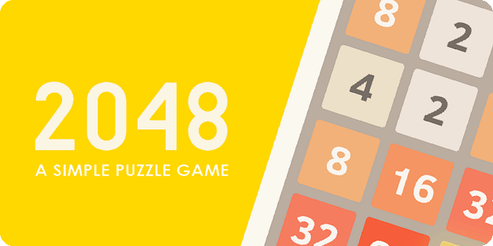
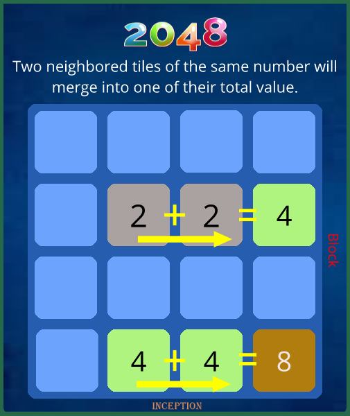
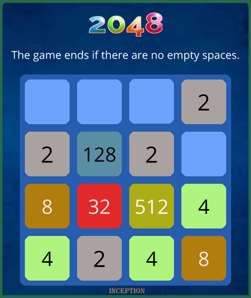

Here’s a corrected and polished version of your README:

---

# 2048 Game (C++)

This project is a full implementation of the classic **2048 puzzle game** written in **C++**, developed as part of an advanced programming course. The focus is on applying **Object-Oriented Programming (OOP)** principles, **data structures**, and **algorithms** to build an interactive game from scratch.





## Features

* Classic **4×4 grid 2048 gameplay** with smooth tile merging and score tracking.
* User interface with menus: **New Game**, **High Score**, and **Settings**.
* **Pause menu**, sound effects, and animations for a better user experience.
* Persistent **high score saving**.
* Support for **keyboard input** (arrow keys).

## Technical Highlights

* Written in **C++ (100% self-coded)** using **Visual Studio 2019**.
* Graphics and event handling powered by the **SDL library**.
* Modular OOP design with multiple classes:

  * `Game`, `Object`, `TextObject`, `PauseMenu`, `Animation`, etc.
  * `SolveTable` for core algorithms (Up, Down, Left, Right).
  * `Random` for tile generation.
* Clear project organization with **header files** (`.h`) and **source files** (`.cpp`).

## Project Structure

```
GAME2D_INCEPTION/
  Main.cpp
  Game.cpp / Game.h
  SolveTable.cpp / SolveTable.h
  Object.cpp / Object.h
  TextObject.cpp / TextObject.h
  ...
assets/
  Images/
  Sounds/
  Fonts/
```

## How to Play

Use the **arrow keys** to slide tiles. Tiles with the same number merge into one.
Reach **2048** to win. If no moves are left, the game ends.

## Conclusion

This project demonstrates how **C++ OOP design** and **algorithms** can be applied to build a complete, playable game. While simple in graphics, it emphasizes code structure, logic, and maintainability.

